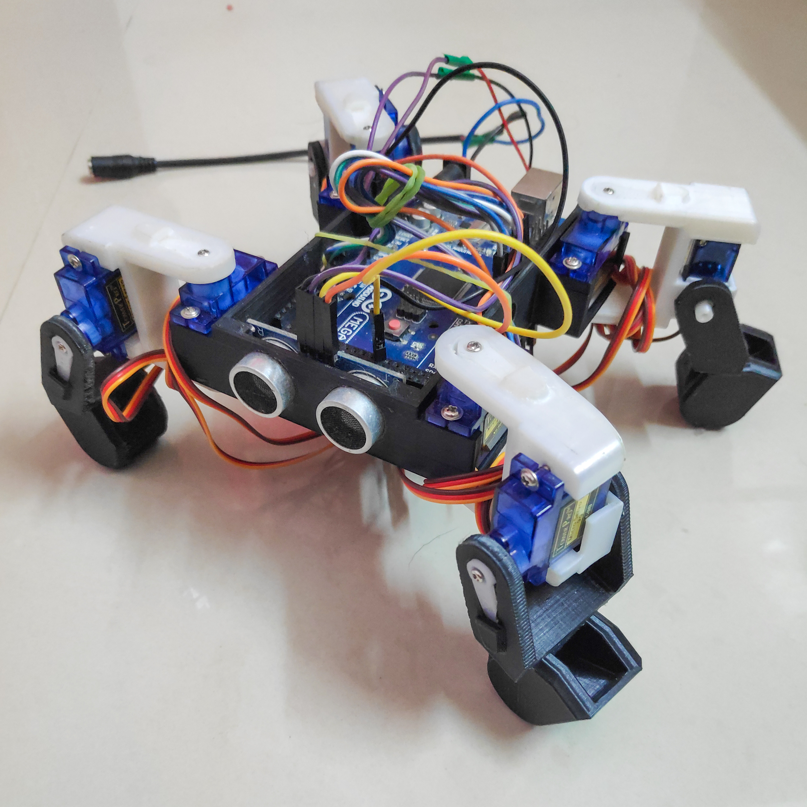

# Quarduped with ultrasonic sensor

This repo has the files that were used for building Quarduped. This mini project was a part of the subject Embedded Computing for Data Science.

## Final model
The working model🤖 is shown below.

## 3D printing parts
The stl files used for this project can be find [here](https://www.thingiverse.com/thing:3460326).

## Hardware requirements

 | Hardwares | Quantity     | Notes                |
| :-------- | :------- | :------------------------- |
| Arduino Mega developing board | 1 | Arduino UNO with servo shield can also be used |
| Tower Pro SG90 servo motors | 8 | - |
| HC-SR04 Ultrasonic Sensor | 1 | - |
| Perfboard | 1 | optional |
| 9V battery | 1 | 9V AC-DC wall adapter can also be used |
| LM2596S DC-DC buck converter | 1 | - |
| Connecting wires | As required | - |
| 3D printed body parts | As required | - |

## Software requirements
[Arduino IDE](https://www.arduino.cc/en/software) 

## Flowchart

## Circuit Diagram
[Reference](http://meped.io/sites/default/files/inline-images/mePed%20Wiring%20Diagram%20500.jpg)